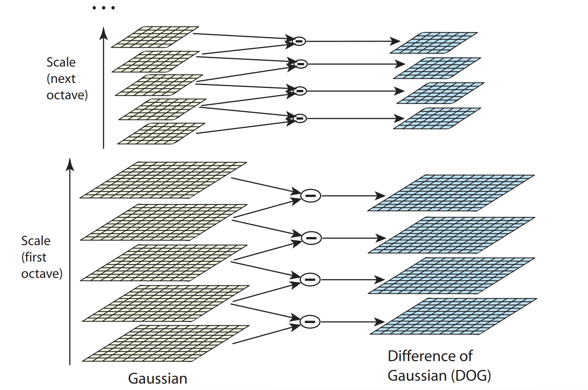
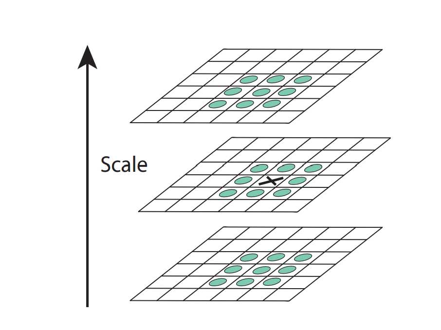
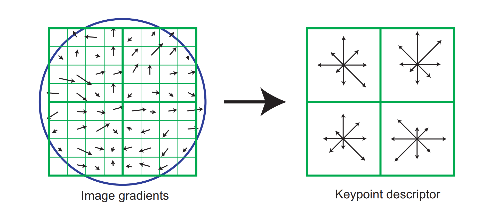

# Distinctive Image Features from Scale-Invariant Keypoints  论文解读

著名的SIFT local feature提取方法

### Scale-space extrema detection  

初步筛查出keypoints

$L(x,y,\sigma) = G(x,y,\sigma)*I(x,y)$

其中 $G(x,y,\sigma)=\frac{1}{2\pi\sigma^2}e^{-(x^2+y^2)/2\sigma^2}$是高斯函数，$I(x,y)$是输入图片，$*$是卷积

difference-of-Gaussian:

$D(x,y,\sigma)=(G(x,y,k\sigma)-G(x,y,\sigma))*I(x,y)=L(x,y,k\sigma)-L(x,y,\sigma)$

其中k是常数

每个octave中$\sigma$从下到上成等比数列（$\sigma$定义如上面的式子），相差k

上面的octave是下面的进行down sampling变成的1/2大小的图片，从而在不同scale提取

然后找DOG中极值

一个点比上下左右这些点都大或都小，就是极值。

### Keypoint localization  

下一步确定location, scale和ratio of principal，并筛去一些low contrast或poorly localized along an edge的点，找原图上对应的点的位置

$D(x)=D+\frac{\partial D^T}{\partial x}x+\frac 1 2 x^T\frac{\partial^2D}{\partial x^2}x$ （2）

其中D和它的导数是在sample point的值，$x = (x,y,\sigma)^T$是相对于sample point的offset

令（2）的导数为0，得出极值点：

$\hat x = -\frac{\partial^2D}{\partial x^2}^{-1}\frac{\partial D}{\partial x}$

代入（2）

$D(\hat x)=D+\frac 1 2 \frac{\partial D^T}{\partial x}\hat x$

如果$|D(\hat x)|$小于某个值，说明这个点不明显，要舍去

$H=\begin{bmatrix}D_{xx}&D_{xy}\\D_{xy}&D_{yy}\end{bmatrix}$

$D_{xx}$等是二阶偏微分，求H的特征值，如果两个特征值相差太大，说明是poorly localized along an edge，这时要舍去。

设特征值$\alpha$, $\beta$. 设$\alpha=r\beta$, r>1

$\frac{Tr(H)^2}{Det(H)} = \frac{\alpha+\beta}{\alpha\beta}=\frac{(r\beta+\beta)^2}{r\beta^2}=\frac{(r+1)^2}{r}$

Tr为迹，Det为行列式

所以要r小于某个值$r_0$,只要确认

$\frac{Tr(H)^2}{Det(H)}<\frac{(r_0+1)^2}{r_0}$

### Orientation assignment

确认方向orientation，使用L的gradient的近似，大小为$m(x,y)$, 方向为$\theta(x,y)$

$m(x,y)=\sqrt{(L(x+1,y)-L(x-1,y))^2+(L(x,y+1)-L(x,y-1))^2}$

$\theta(x,y)=\tan^{-1}((L(x,y+1)-L(x,y-1))/(L(x+1,y)-L(x-1,y)))$

在sample point周围一定大小的区域求这个值，然后把$\theta$画在直方图里，直方图最大值作为这个点方向，如果几个最大值接近，就几个方向都保留  

### Keypoint descriptor  

 

在keypoint descriptor周围区域计算sample point的gradient magnitude和orientation，用Gaussian window加权，然后计入方向直方图，结果直观如右图所示，其中箭头长度表示那个方向的gradient magnitude求和，也就是说，上图有2x2=4个直方图，每个直方图有8个值，所以一共是4x8=32个值，也就是说descriptor vector有32维（实际最好维4x4x8=128维）

至此就有了local descriptor的location, scale, orientation和descriptor vector，就可以用这些特征来区分图像了！