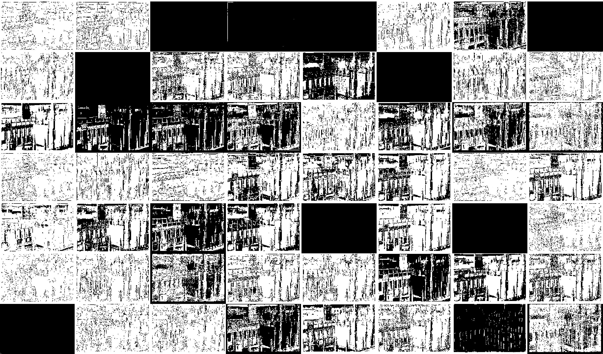
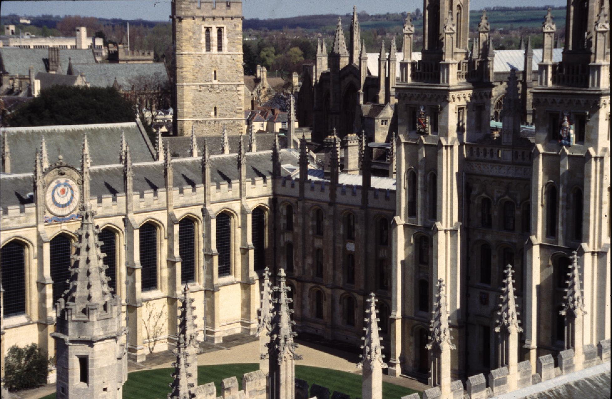

# CNN 激活层输出可视化

import

```python
import torchvision.transforms
from torchvision import models
import torch
from PIL import Image
import cv2
import numpy as np
```

get network

```python
net = models.resnet18(pretrained=True)
layers = list(net.children())
print(layers)
```

get image

```python
trans = torchvision.transforms.ToTensor()
img = Image.open("../data/oxbuild_images-v1/all_souls_000001.jpg")
img = trans(img)
img = torch.unsqueeze(img, 0)
print(img.size())
x = img
```

iterate and concatenate CNN output at layer 2

```python
img_rows = []
img_row = []
for idx, layer in enumerate(layers):
    print(idx)
    print(layer)
    x = layer(x)
    print(x.size())
    if idx == 8:
        x = x.squeeze(3).squeeze(2)
    if idx == 2:
        for i in range(64):
            if i > 0 and i % 8 == 0:
                img_row = np.concatenate(img_row, axis=1)
                img_rows.append(img_row)
                img_row = []
            cnn_img = x[:, i, :, :]
            print(cnn_img.size())
            cnn_img = cnn_img.permute(1, 2, 0)
            cnn_img = cnn_img.detach().numpy()
            cnn_img = cnn_img * 255
            cnn_img = cnn_img.astype(np.int8)
            # x, y = cnn_img.shape[:2]
            # scale = 0.5
            # cnn_img = cv2.resize(cnn_img, (round(x * scale), round(y * scale)))
            img_row.append(cnn_img)
            # cv2.imshow(f"cnn{i}", cnn_img)
        img_rows = np.concatenate(img_rows, axis=0)
        print(img_rows.shape)
        img_rows = img_rows.astype(np.float64)
        img_rows = cv2.resize(img_rows, None, fx=0.3, fy=0.3)
        cv2.imshow("cnn", img_rows)
```

output the original image and wait key

```python
img = cv2.imread("../data/oxbuild_images-v1/all_souls_000001.jpg")
cv2.imshow("img", img)

cv2.waitKey()
```

结果：



原图：



完整程序：

```python
import torchvision.transforms
from torchvision import models
import torch
from PIL import Image
import cv2
import numpy as np


net = models.resnet18(pretrained=True)
layers = list(net.children())
print(layers)
trans = torchvision.transforms.ToTensor()
img = Image.open("../data/oxbuild_images-v1/all_souls_000001.jpg")
img = trans(img)
img = torch.unsqueeze(img, 0)
print(img.size())
x = img

img_rows = []
img_row = []
for idx, layer in enumerate(layers):
    print(idx)
    print(layer)
    x = layer(x)
    print(x.size())
    if idx == 8:
        x = x.squeeze(3).squeeze(2)
    if idx == 2:
        for i in range(64):
            if i > 0 and i % 8 == 0:
                img_row = np.concatenate(img_row, axis=1)
                img_rows.append(img_row)
                img_row = []
            cnn_img = x[:, i, :, :]
            print(cnn_img.size())
            cnn_img = cnn_img.permute(1, 2, 0)
            cnn_img = cnn_img.detach().numpy()
            cnn_img = cnn_img * 255
            cnn_img = cnn_img.astype(np.int8)
            # x, y = cnn_img.shape[:2]
            # scale = 0.5
            # cnn_img = cv2.resize(cnn_img, (round(x * scale), round(y * scale)))
            img_row.append(cnn_img)
            # cv2.imshow(f"cnn{i}", cnn_img)
        img_rows = np.concatenate(img_rows, axis=0)
        print(img_rows.shape)
        img_rows = img_rows.astype(np.float64)
        img_rows = cv2.resize(img_rows, None, fx=0.3, fy=0.3)
        cv2.imshow("cnn", img_rows)

img = cv2.imread("../data/oxbuild_images-v1/all_souls_000001.jpg")
cv2.imshow("img", img)


cv2.waitKey()
```

