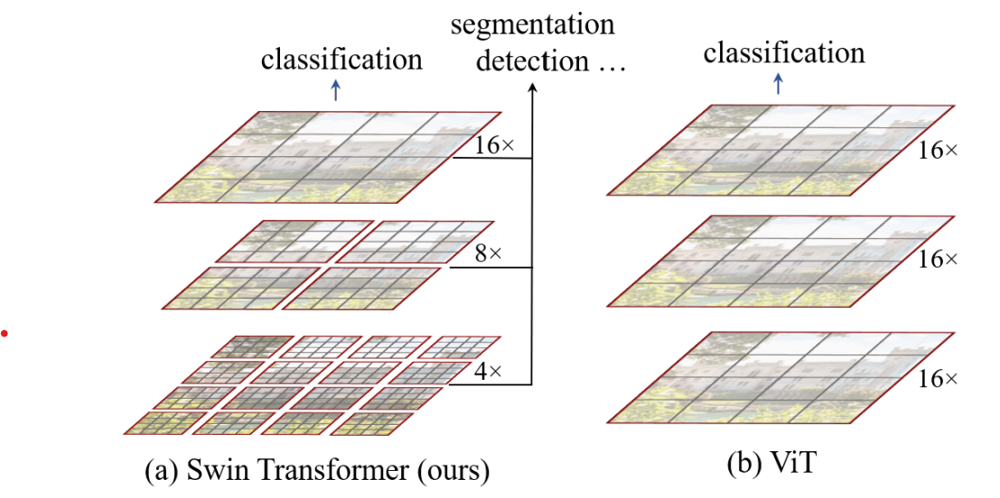
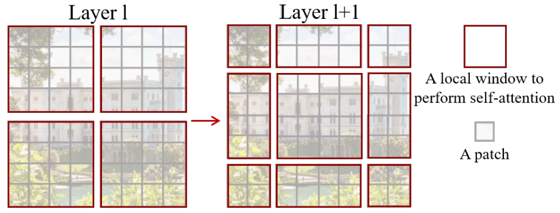
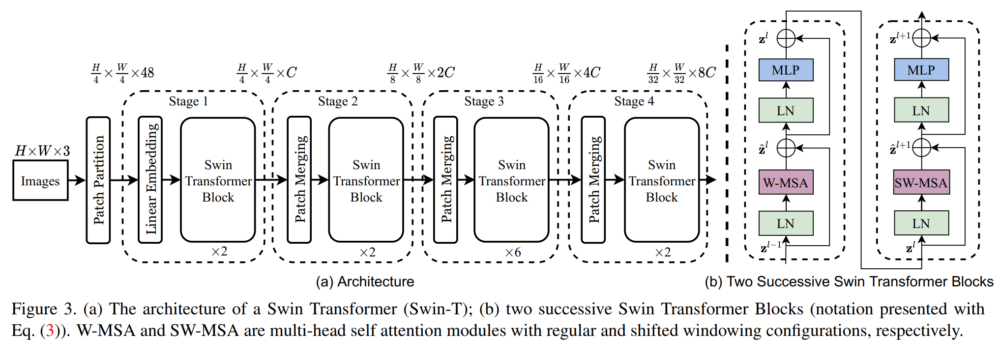
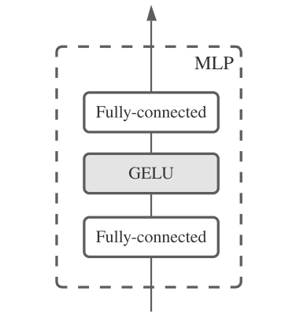
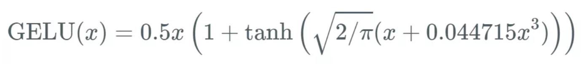
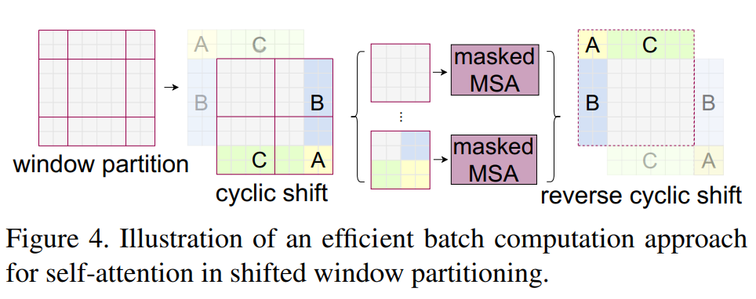

# Swin Transformer: Hierarchical Vision Transformer using Shifted Windows  论文解读

**transformer 用于 Computer Vision的问题：**

1. 图像中的对象有不同的scale，不同于语言处理
2. 图像像素很多，比NLP中的word多得多

### 为了解决这些问题:

swin transformer使用了shifted window的技术，并且从较小的window逐渐聚合成较大的window

最开始是4x4的window，每个window转化为一个vector，对这些vector分为一些小window，对每个小window做self attention，然后再聚合，以此类推。

一个重要的创新是sifted window, 对window做一个移动，如上图，第$l$层是左边的window划分，则第$l+1$层是右边的window划分

### Overall Architecture

首先是一个RGB图片，分成很多4x4的window，对每个window，可以拼成4x4x3=48的vector（3是channel），然后对这些vector做一个linear embedding，把它们变成C维vector

把这些vector再划分为window，在每个window内部进行self attention，也就是W-MSA，这一层对vector的

这种操作不会改变vector的数量和dimension，然后出来之后再做一个Patch Merging，变成一个4C的向量，再进行一个linear embedding，化成2C，依次类推。

每一个小block的结构如Figure3 (b),其中MLP机构如下

其中GELU定义如下

LN是layer norm的意思，算的方法如下，是对layer做norm，其中$\gamma$和$\beta$是可以训练的参数：

$y=\frac{x-E[x]}{\sqrt{Var[x]+\epsilon}}*\gamma + \beta$

其中W-MSA是没有shift的window multi-head self attention, SW-MSA是shifted之后的。

shift的方法如上图，用的是一个roll之后的，及把右上的那些块在shift之后拼接到左下

然后注意到每一个MLP和W-MSA都有一个residual的操作，是一个相加。

### Relative position bias  

在算attention的时候还有一个Relative position bias, 也就是说在算的时候要加一个bias

$Attention(Q, K, V ) = SoftMax(QK^T/\sqrt d + B)V$

### Architecture Variants

Swin-T: C = 96, layer numbers = {2, 2, 6, 2}
Swin-S: C = 96, layer numbers = {2, 2, 18, 2}
Swin-B: C = 128, layer numbers = {2, 2, 18, 2}
Swin-L: C = 192, layer numbers = {2, 2, 18, 2}

上面是四个从小到大规模的swin transformer模型，其中的数字表现每个basic layer的基本block的层数。

